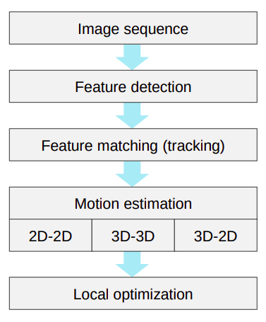

# Dean VO

## Purpose
This implementation of Visual Odometry is meant to be modular enough to replace, add, and experiment with the different components of visual odometry.

## Building

**Requirements**
 - OpenCV (I am using 4.2 but most versions should work)
 - cmake

```shell
$ cd dean-vo
$ mkdir build
$ cd build
$ cmake ..
$ make
$ ./vo <argument>
```

<!--  -->

### Things to experiment with
 - How to move data and images through the VO pipeline
    - Gstreamer, Pipes, Localhost
 - Feature detection techniques
 - Feature matching and tracking techniques
 - Motion Estimation
 - Constraining motion to 2D space
 - Robust estimation (RANSAC)
 - Error Propagation
 - Camera-pose optimization (bundle adjustment)
 - Loop Closure

---

## Resources:
 - [Scaramuzza Tutorial on Visual Odometry](http://rpg.ifi.uzh.ch/docs/Visual_Odometry_Tutorial.pdf)
 - [Vishal's Feature Extractor](https://bitbucket.org/freshconsulting/workspace/snippets/5LM5b4)
 - [Stereo Image Lecture - stereo with calibrated cameras](https://www.cs.utexas.edu/~grauman/courses/fall2009/slides/lecture13_stereo1.pdf)
 - [Essential and Fundamental Matrices - Penn State](http://www.cse.psu.edu/~rtc12/CSE486/lecture19.pdf)
 - [FINDING OPTIMAL ROTATION AND TRANSLATION BETWEEN CORRESPONDING 3D POINTS](http://nghiaho.com/?page_id=671)
 - [Introduction to Visual Odometry - Karel Zimmermann](https://cw.fel.cvut.cz/old/_media/courses/a3m33iro/vo.pdf)
- [Two-View Geometry - George Mason University](http://www.vision.jhu.edu/teaching/vision05/Lecture-D.pdf)
